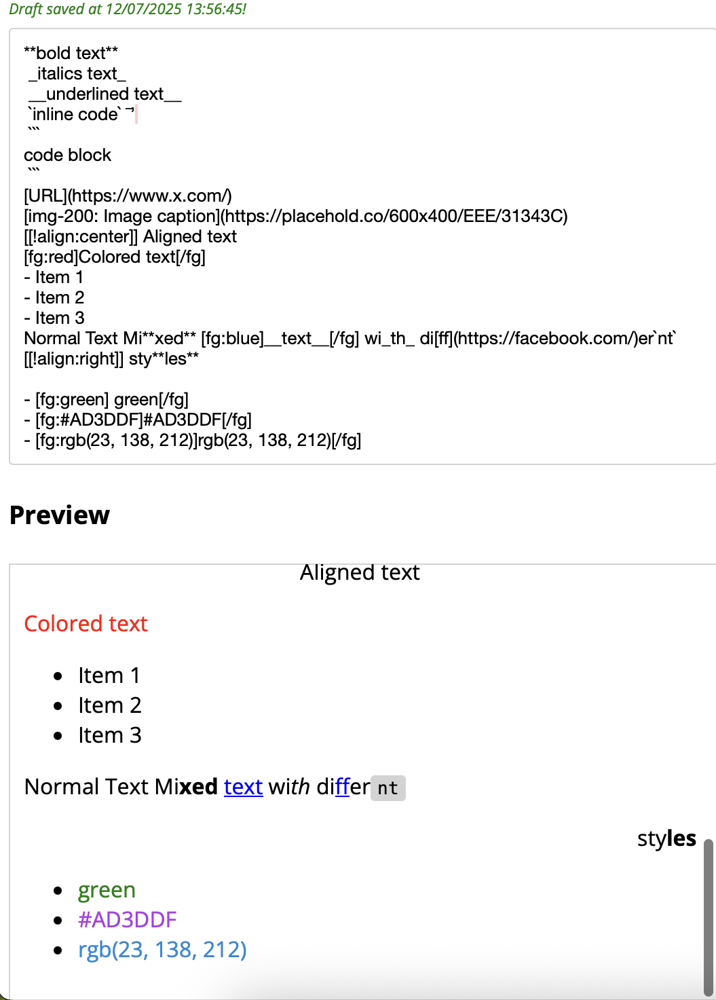

# Simple Markdown Editor for ReactJS 🪶

Simple markdown text editor that you can implement into your own React project. Easy to use and integrate.

## Available styles 🎀
The editor offers the following baseline styles (for now):
- `_italics_`
- `**bold**`
- `__underlined__`
- \`inline code\`
- \`\`\`code block\`\`\`
- `[<link>](<url>)`
- `[img-<size>:<caption>](<url>)`
- `[[!align:<alignment>]]`
- `[fg:<color>]<text>[/fg]`
- Unordered list with `-`

## Properties ℹ️
The component accepts the following properties:
- `className` (required): You must assign a class name to the component.
- `width` (optional - defaults to 500px): The width of the editor.
- `height` (optional - defaults to 300px): The height of the editor.
- `id` (optional): A unique identifier for the editor.
- `showPreview` (optional - defaults to true): Whether to show a preview of the formatted data.
- `onContentChange` (optional): Use a callback function so that the formatted output is passed.
